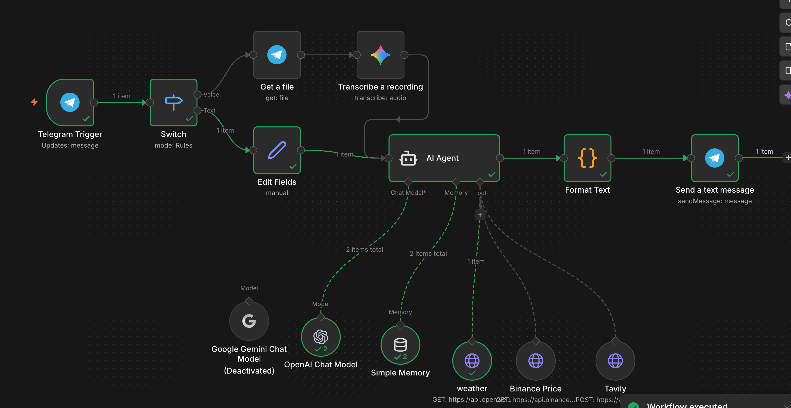
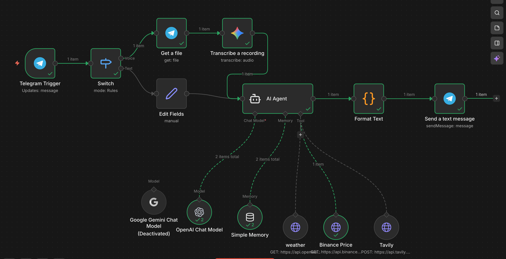
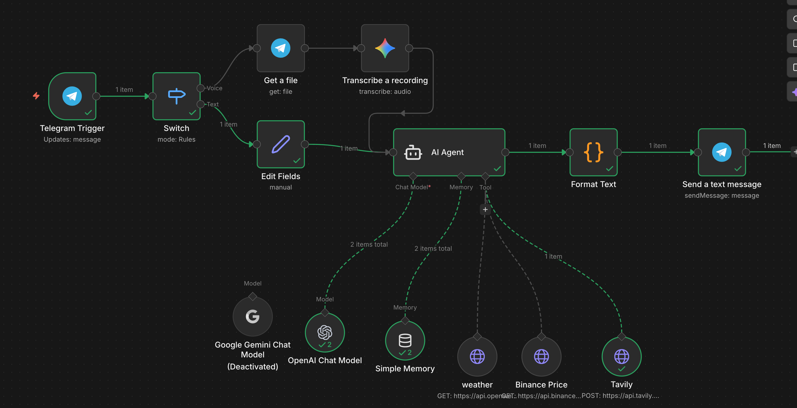
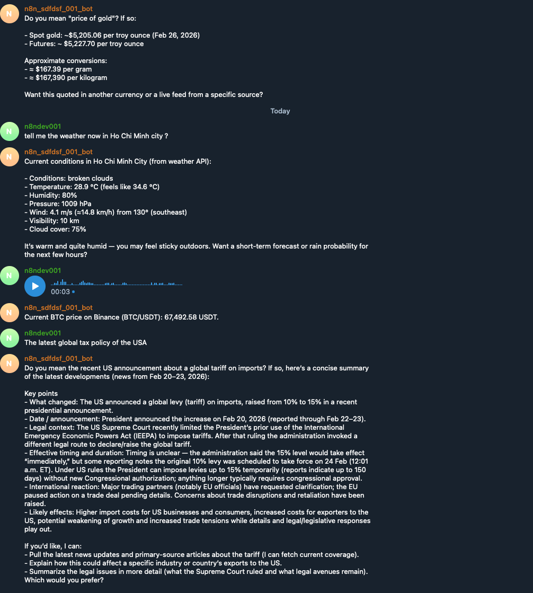

# Telegram AI Automation Bot

### 🚀 Projects
A production-style Telegram bot built with **n8n** that supports:
- Real-time web search via **Tavily**
- Crypto price lookup via **Binance API**
- Weather lookup via public **Weather API**
- AI Agent orchestration (OpenAI Chat Model)
- Containerized local deployment with Docker


## Features

- **Telegram command/message intake** (group/private chat)
- **AI Agent router** that decides when to call tools
- **Tooling integrations**
  - Tavily Search (latest news, web results)
  - Binance Price API (spot price queries)
  - Weather API (current conditions)
- **Response formatting** for Telegram delivery
- Optional: Audio message path (file download → transcription → agent)

## Tech Stack
- n8n (self-hosted)
- Telegram Bot API
- OpenAI Chat Model (agent reasoning)
- Tavily Search API
- Binance Public API
- Weather API
- Docker Compose

## Architecture


```
Telegram
  │
  ▼
n8n Telegram Trigger
  │
  ├─(text)────> Switch/Normalize Input ──> AI Agent ──> Format Text ──> Telegram Reply
  │
  └─(voice)───> Get File ──> Transcribe ───────────────┘
                     │
                     ▼
                AI Agent Tools
                 ├─ Tavily (web search)
                 ├─ Binance API (price)
                 └─ Weather API
```








#### 🐳 Deployment
```
docker compose up -d
```

#### 🖼 Demo


